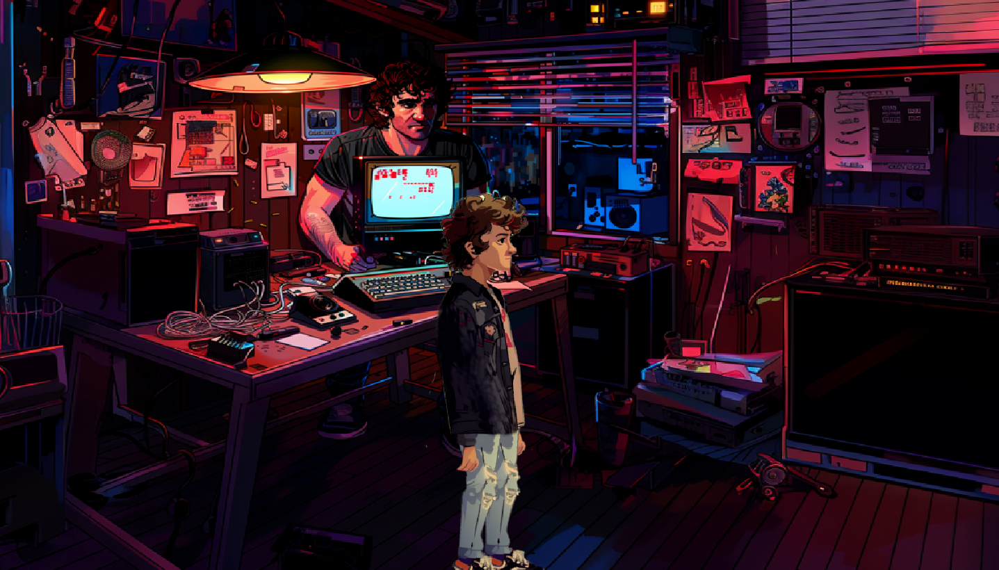

# 🎮 Arcade boy

## Description

Ce projet est un jeu narratif développé avec **Kaboom.js**. Il met en scène une borne d'arcade rétro où le joueur peut interagir avec différents personnages et objets pour faire évoluer les relations et progresser dans l’histoire.

### **Fonctionnalités principales :**

- 🎮 **Déplacement** avec les **touches fléchées**.
- 🎒 **Interaction** via la **touche "I"** pour ouvrir l’inventaire/résumé des relations ; et en cliquant sur les zones de dialogues.
- 🗨️ **Dialogue dynamique** influençant les relations avec les personnages.
- 🎨 **Style 32 bits**, inspiré des classiques des années 80-90.

---

## 📸 **Aperçu du Jeu**



---

## 🚀 **Instructions d’Installation et d’Exécution**

### **1. Cloner le Dépôt**

```bash
git clone https://github.com/votre-utilisateur/nom-du-repo.git
cd nom-du-repo
```

### **2. Installer les Dépendances**

Assurez-vous d’avoir **Node.js** installé, puis exécutez :

```bash
npm install
```

### **3. Construire le Projet**

```bash
npm run build
```

### **4. Démarrer le Serveur Local**

Si vous utilisez **Visual Studio Code**, ouvrez `index.html` avec **Live Server**.  
Sinon, vous pouvez démarrer un serveur simple avec **Python** :

```bash
python -m http.server
```

Puis, ouvrez votre navigateur à **http://localhost:8000/** *(ou le port défini)*.

---

## 🛠 **Modules et Librairies Utilisés**

- [**Kaboom.js**](https://kaboomjs.com/) – Moteur de jeu en JavaScript.
- **Live Server** *(optionnel)* – Extension **Visual Studio Code** pour lancer un serveur local.

---

## 📝 **Sources et Licence**

Ce projet contient :

- Des éléments de **code réutilisé** avec modifications, provenant de la documentation officielle de **Kaboom.js**.
- Des ressources graphiques **créées sur mesure**, sauf indication contraire dans le dossier `/sprites`.

📜 **Licence : MIT**
👨‍🎓 **Développé dans le cadre du cours** *Fiction interactive* dispensé par **Isaac Pante** (*Humanités numériques, Lettres, UNIL*).

---

### 🌍 **Démo en Ligne**

Si vous avez hébergé le projet sur **GitHub Pages** ou **Netlify**, ajoutez ici le lien :

🔗 [Démo du jeu](https://grand-faun-8d2d5f.netlify.app/)

---

💡 *Si vous avez des questions ou suggestions, n'hésitez pas à ouvrir une issue !*  
🚀 *Bon jeu !*